<p align="center">
  
</p>

<p align="center">
  <a href="https://github.com/ZizhuangCui/codex-jev-imagegen/actions/workflows/ci.yml"></a>
  <a href="LICENSE"></a>
  
  
</p>

<p align="center"><strong>Give image generation a decision step, a memory of what to preserve, and a stopping point.</strong></p>
<p align="center">English · <a href="README.zh-CN.md">简体中文</a></p>

Jev ImageGen is a reusable **Codex skill** that puts [TypeSafe's Jev](https://docs.typesafe.ai/introduction) around Codex image-generation workflows. Jev classifies the request; Codex works with the images, writes the prompt, and checks the result. When a repair is useful, Jev can recommend the next action from a textual inspection report.

**v0.2.0 is an experimental workflow.** The helper and offline checks are implemented. Live Jev accuracy, end-to-end image quality, latency improvements, and cost savings have **not** been validated. This repository contains no generated-image benchmark or sample image presented as a real result.

## What it does

- **Choose the task:** generate a new image, edit an existing image, or discuss without generating.
- **Carry constraints forward:** keep identity, composition, and exact-text requirements visible across edits.
- **Make repairs deliberate:** inspect the actual output, then choose a local edit, a fresh attempt, or review.
- **Keep execution bounded:** default to one image call plus at most one repair; expose failures and fallbacks.

The selected image tool remains the image generator. This is a skill and a small Python helper, not a standalone web app, a new image model, or a model-inference accelerator.

## Quick start

Requirements: Python 3.10+, Git, and a Codex environment with built-in `image_gen` or a compatible connected image tool. The helper has **no third-party Python dependencies**. Jev access is required only for live Jev decisions.

```sh
git clone https://github.com/ZizhuangCui/codex-jev-imagegen.git
cd codex-jev-imagegen
python3 install.py
```

The installer copies `skills/jev-imagegen` into `${CODEX_HOME:-~/.codex}/skills/jev-imagegen`. It refuses to overwrite an existing installation. Reload skills or start a new Codex session if the skill does not appear.

Then attach your image in Codex and ask:

```text
Use $jev-imagegen to change this portrait's background to a rainy street at night.
Preserve the person's identity and glasses. Inspect the result before delivery.
```

### Try the decision request without a key

From the cloned repository:

```sh
python3 skills/jev-imagegen/scripts/decide.py \
  --phase plan --input examples/generate.json --mode request
```

This prints the **request that would be sent**. It does not contact Jev, generate an image, or simulate a model answer. [Edit](examples/edit.json) and [review](examples/review.json) inputs are also supplied; all examples are synthetic inputs.

### Enable live Jev decisions

Provide `TYPESAFE_API_KEY` through your local secret manager or the environment inherited by Codex. Do not paste it into a prompt, a JSON request, or this repository. A running Codex process will not automatically inherit environment changes made in another terminal. Obtain access through the [official TypeSafe console](https://console.typesafe.ai/).

```sh
python3 skills/jev-imagegen/scripts/decide.py \
  --phase plan --input examples/generate.json --mode live
```

Jev is billed separately by its provider. The default built-in image path does not use an `OPENAI_API_KEY`. No credentials produces an explicit `missing_key` fallback; it is never presented as a successful Jev decision.

The CLI only returns decision JSON. **Codex executes the image tool calls** when following the skill.

## The workflow

```mermaid
flowchart LR
  A[Request + confirmed constraints] --> B[Jev: intent and requirements]
  B --> C[Codex: validate and compile prompt]
  B -. unavailable or uncertain .-> F[Explicit Codex fallback]
  F --> C
  C --> D[Built-in or connected image tool]
  D --> E[Codex inspects actual image]
  E -->|Meets requirements| G[Save and deliver]
  E -->|Repair needed| H[Jev reads inspection report]
  H --> I[At most one targeted repair]
  I --> G
```



Jev receives **text**, not pixels. An inspection report must come from an actual image observer. The skill instructs Codex to preserve approved anchors and apply the call budget; those controls are agent instructions, not a server-enforced state machine. The helper enforces its own input/response checks and single-request transport behavior.

## Multi-model support

One Jev workflow supports **GPT Image, Nano Banana, and Seedream** through model-aware routing to connected Codex tools.

| Family | Registered versions |
| --- | --- |
| GPT Image | 1, 1 mini, 1.5, 2, 2.5 Sunburst, 2.5 Flare |
| Nano Banana | Original, Pro, 2, 2 Lite |
| Seedream | 4.0, 4.5, 5.0, 5.0 Lite, 5.0 Pro |

**Default:** Codex built-in `image_gen`, with a platform-managed model. **Specific versions / external families:** require a connected tool that explicitly supports the requested model. This release implements the catalog, capability checks and agent handoff; it does not bundle external API clients or establish live provider validation. Registering a model does not make it available in your session. External provider access/billing is separate.

```text
Use $jev-imagegen with Nano Banana Pro to edit this image. Preserve the person's identity.
Use $jev-imagegen with Seedream 5.0 Pro to generate a product poster.
Use $jev-imagegen with GPT Image 2.5 Sunburst to repair the attached image.
```

The skill discovers the connected tool before calling it and stops if the requested model, edit operation or reference capacity is unavailable. It never silently substitutes a model. `Image 2.5` alone needs a Sunburst/Flare choice. [Version IDs and official sources](skills/jev-imagegen/references/capabilities.md) · [Tool-routing contract](skills/jev-imagegen/references/providers.md)

```sh
# List registered models; no network calls or generation.
python3 skills/jev-imagegen/scripts/route.py --list
```

## Checks and failure behavior

```sh
python3 -B skills/jev-imagegen/scripts/test_decide.py
python3 -B -m unittest discover -s tests -v
```

All tests run offline with mocked transport. They check request preparation, missing credentials, uncertainty, edit-target requirements, inspection prerequisites, malformed responses, timeout handling, installation, and CLI exit codes. They do not measure model accuracy.

| Exit | Meaning |
| --- | --- |
| `0` | Request prepared, or live recommendation passed schema/threshold checks |
| `2` | Invalid input, file, or options |
| `3` | Explicit fallback; inspect `reason` |

Live mode makes one HTTPS attempt to the official endpoint, uses an eight-second socket timeout, and does not retry or follow redirects. It omits exception bodies and authorization headers from output. The default confidence floor of `0.8` is **not calibrated for this application** and is not an 80% correctness guarantee.

## Design notes

This project was inspired by the Jev-guided control experiment in [sepiablue-ai/ComfyUI-MiniMax-H3-W4A4-VSA](https://github.com/sepiablue-ai/ComfyUI-MiniMax-H3-W4A4-VSA/tree/exp/jev-adaptive-vsa). That project can modify local attention kernels; the Codex built-in image tool cannot. Its reported speedup is not a benchmark for this repository. Our code was written independently; no GPL GPU patch code is included. [Read the source audit](skills/jev-imagegen/references/research.md).

Explore the [decision contract](skills/jev-imagegen/references/contract.md), [evaluation plan](docs/EVALUATION.md), [roadmap](docs/ROADMAP.md), and [contribution guide](CONTRIBUTING.md).

## License

[MIT](LICENSE) for this repository's code, documentation, and original artwork. Provider services, model weights, and user images retain their own terms. An independent community project; not affiliated with OpenAI, TypeSafe, or ByteDance.

[Development & milestones](docs/DEVELOPMENT.md) · [Issues](https://github.com/ZizhuangCui/codex-jev-imagegen/issues) · [Changelog](CHANGELOG.md)
