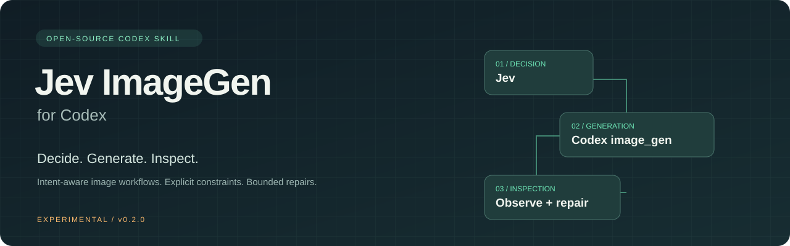
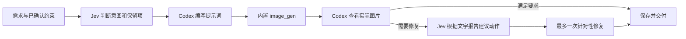

<p align="center"></p>

<p align="center"><a href="README.md">English</a> · 简体中文</p>

# Jev ImageGen for Codex

**给图片生成加上明确的判断、持续保留的约束，以及有限的修复次数。**

这是一个可复用的 Codex Skill：Jev 判断用户想新建、编辑还是讨论；Codex 理解参考图、编写提示词、调用内置 `image_gen`，再检查真实成图。需要修复时，Jev 可以根据文字检查报告建议下一步。

> **v0.1.0 实验版。** 已实现 Skill、Jev 调用脚本和离线测试。尚未验证真实 Jev 的判断准确率、端到端生成效果、加速幅度或费用节省。仓库没有冒充实测结果的生成样图。

## 它解决什么问题

- **选对流程**：区分新建、修改已有图片、仅讨论方案。
- **保留关键要求**：人物身份、构图、指定文字，不因下一轮没提到就被遗忘。
- **有依据地修复**：先看实际图片，再决定局部修复、重新生成或转人工检查。
- **控制调用次数**：默认每张图片一次生成、最多一次修复；失败时明确回退。

它是一个 Skill 和小型决策脚本，不是独立网站、生图模型或底层推理加速器。

## 安装

需要 Python 3.10+、Git，以及已提供内置 `image_gen` 的 Codex 环境。Python 脚本不依赖第三方包。

```sh
git clone https://github.com/ZizhuangCui/codex-jev-imagegen.git
cd codex-jev-imagegen
python3 install.py
```

安装器将技能复制到 `${CODEX_HOME:-~/.codex}/skills/jev-imagegen`，遇到同名目录会停止，不会覆盖已有版本。若技能未出现在列表中，刷新技能或开启新的 Codex 会话。

上传你的图片，然后说：

```text
使用 $jev-imagegen，把这张人物图的背景改成雨夜街景。
人物长相和眼镜保持不变，生成后检查结果。
```

## 先离线试试

在仓库目录执行：

```sh
python3 skills/jev-imagegen/scripts/decide.py \
  --phase plan --input examples/generate.json --mode request
```

这只打印准备发送的请求，不联网、不生图、不模拟 Jev 回答。[编辑示例](examples/edit.json)和[检查报告示例](examples/review.json)也都是合成输入，不是实测记录。

## 启用真实 Jev

在 [TypeSafe 官方控制台](https://console.typesafe.ai/)取得访问权限，通过本地密钥管理器或 Codex 进程继承的环境变量提供 `TYPESAFE_API_KEY`。不要将密钥写进聊天、示例 JSON 或仓库。已经运行的 Codex 不会自动获得另一个终端里刚设置的环境变量。

```sh
python3 skills/jev-imagegen/scripts/decide.py \
  --phase plan --input examples/generate.json --mode live
```

Jev 单独按供应商计费；Codex 内置生图路径不使用 `OPENAI_API_KEY`。缺少 Jev 凭据时明确标记 `missing_key`，后续如采用 Codex 判断，也不会冒充 Jev 的结果。CLI 只返回判断，实际图片工具由 Codex 调用。

## 怎么分工



Jev 不看图片，只读取文本。已批准原图、约束保留、图片调用预算由 Skill 指导 Codex 执行，**不是后台服务强制保证**；脚本负责输入校验、答案校验、单次网络调用和明确错误状态。

## 模型支持范围

| 路径 | 当前状态 |
| --- | --- |
| Codex 内置 image_gen | 已实现 Skill 调用流程，端到端实测待完成；当前会话须有该工具。 |
| GPT Image 1 / 2 / 2.5 | 已整理能力与迁移设计；内置工具当前没有型号选择参数。 |
| Seedream 5.0 Pro | 已纳入外部生成后端设计；适配器、凭据与真实调用尚未完成。 |

指定某个模型时，不会静默换成其他模型。首个工作流版本不等于指定 `gpt-image-1`。[完整能力边界](skills/jev-imagegen/references/capabilities.md)

## 验证

```sh
python3 -B skills/jev-imagegen/scripts/test_decide.py
python3 -B -m unittest discover -s tests -v
```

测试全部离线运行，包括缺密钥、低置信度、缺编辑目标、未看图就申请审核、错误返回、超时、安装与命令行行为；网络结果使用 mock，不构成准确率评测。`0.8` 置信度门槛只是待校准初值。

默认每个资产最多一次前置 Jev 判断、一次必要的后置判断；图片最多一次初次生成、一次修复。请求不自动重试、不跟随重定向，不回显密钥与异常正文。

## 参考与后续

灵感来自 [sepiablue-ai 的 Jev + MiniMax H3 实验](https://github.com/sepiablue-ai/ComfyUI-MiniMax-H3-W4A4-VSA/tree/exp/jev-adaptive-vsa)。原项目可修改本地注意力计算，Codex 内置图片工具不开放这类参数。因此没有把原项目的 41.7% 加速写成我们的效果，也没有复制其 GPL GPU 补丁代码。[源码研究记录](skills/jev-imagegen/references/research.md)

下一步是固定同一生成后端，比较“同一工作流由 Codex 判断”和“由 Jev 判断”，再决定哪里值得保留 Jev。[验证方案](docs/EVALUATION.md) · [路线图](docs/ROADMAP.md)

本仓库原创代码、文档与视觉素材采用 [MIT 许可证](LICENSE)。模型服务和用户图片遵守各自条款。本项目与 OpenAI、TypeSafe、字节跳动没有官方关联。
